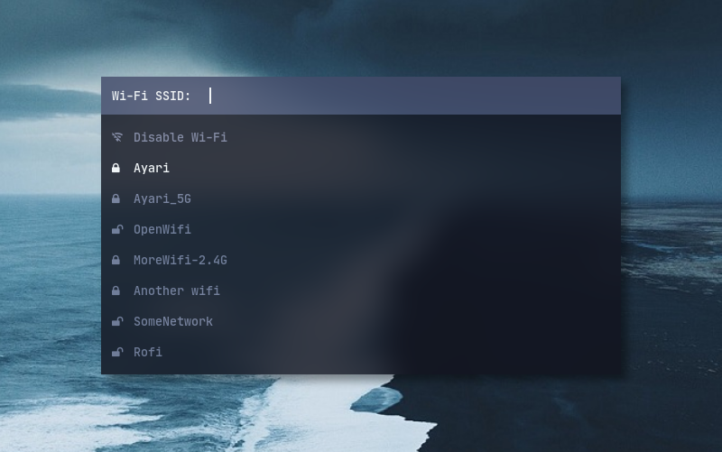

# wofi wifi menu
Gerencie rede wifi pelo Wofi.

$ mv -i  ~/config  ~/.config
 
Renomeia o arquivo ~/.config/wofi/config-menu-wifi para ~/.config/wofi/config

$ mv -i ~/.config/wofi/config ~/.config/wofi/config-backup

$ mv -i ~/.config/wofi/.config-menu-wifi ~/.config/wofi/config
